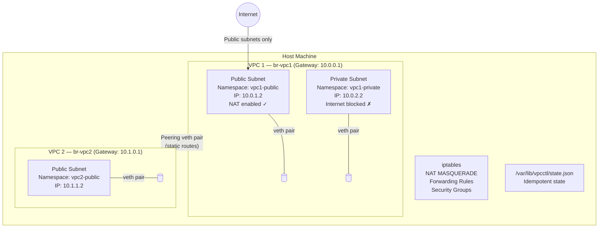

# vpcctl — Build Your Own VPC on Linux


> A Python-based CLI tool that simulates AWS VPC networking from first principles — using only native Linux primitives. No cloud account required. Built to demonstrate deep understanding of how cloud networking actually works under the hood.

This project reimplements the core networking model of a Virtual Private Cloud on a single Linux host using **network namespaces**, **Linux bridges**, **veth pairs**, and **iptables** — the same primitives that power real cloud networking stacks.

---

## Architecture



---

## How Linux Primitives Map to Cloud Concepts

| AWS VPC Concept | Linux Primitive | Implementation |
|---|---|---|
| **VPC** | Linux Bridge (`br-vpcX`) | Central gateway with VPC CIDR gateway IP |
| **Subnet** | Network Namespace (`vpcX-subnetY`) | Isolated network stack per subnet |
| **ENI / NIC** | Veth Pair | Connects namespace to VPC bridge |
| **Route Table** | Static Routes | Default routes point to bridge gateway |
| **NAT Gateway** | `iptables MASQUERADE` | Outbound internet for public subnets |
| **VPC Peering** | Veth Pair + Static Routes | Controlled inter-VPC traffic |
| **Security Group** | `iptables` Rules | Per-subnet ingress/egress firewall |
| **State persistence** | `/var/lib/vpcctl/state.json` | Idempotency and safe cleanup |

---

## Features

- **VPC lifecycle** — create, list, and delete VPCs with custom CIDR ranges
- **Subnet isolation** — public/private subnets as isolated network namespaces
- **NAT gateway** — outbound internet access for public subnets via `iptables MASQUERADE`
- **VPC peering** — controlled inter-VPC communication via veth pairs and static routes
- **Security groups** — JSON-policy-driven `iptables` firewall rules per subnet
- **Test workloads** — deploy Python web servers into subnets for immediate connectivity testing
- **Idempotency** — all commands are safe for repeated runs; state tracked in JSON
- **Full cleanup** — teardown removes all namespaces, bridges, veths, and iptables rules cleanly

---

## Requirements & Installation

| Requirement | Details |
|---|---|
| **OS** | Linux (Ubuntu/Debian recommended; kernel namespace + bridge support required) |
| **Privileges** | Must run as `root` (`sudo`) for network configuration |
| **Tools** | `ip` (iproute2), `iptables`, Python 3.6+ |
| **Dependencies** | **None.** Standard library only — no `pip install` required |

```bash
# Clone the repository
git clone https://github.com/cypher682/vpcctl-linux-networking.git
cd vpcctl-linux-networking

# Make scripts executable
chmod +x vpcctl demo.sh cleanup.sh
```

---

## CLI Reference

Run all commands with `sudo ./vpcctl [command]`.

| Operation | Command |
|---|---|
| Create VPC | `sudo ./vpcctl vpc create --name vpc1 --cidr 10.0.0.0/16` |
| List VPCs | `sudo ./vpcctl vpc list` |
| Delete VPC | `sudo ./vpcctl vpc delete --name vpc1` |
| Add Subnet | `sudo ./vpcctl subnet add --vpc vpc1 --name public --cidr 10.0.1.0/24 --type public` |
| Enable NAT | `sudo ./vpcctl nat enable --vpc vpc1 --interface eth0` |
| Create Peering | `sudo ./vpcctl peer create --vpc1 vpc1 --vpc2 vpc2` |
| Apply Firewall | `sudo ./vpcctl firewall apply --vpc vpc1 --subnet public --policy policy.json` |
| Deploy Workload | `sudo ./vpcctl deploy webserver --vpc vpc1 --subnet public --port 8080` |

### Firewall Policy Example

```json
{
  "subnet": "10.0.1.0/24",
  "ingress": [
    { "port": 8080, "protocol": "tcp", "action": "allow" },
    { "port": 22,   "protocol": "tcp", "action": "deny"  }
  ]
}
```

---

## Full Demo

Run the end-to-end demo to create a full environment, test all features, and clean up:

```bash
sudo ./demo.sh
```

The demo validates:
- ✅ VPC and subnet creation
- ✅ Intra-VPC connectivity (subnet-to-subnet ping/curl)
- ✅ Internet access from public subnets (NAT)
- ✅ VPC isolation (no cross-VPC traffic without peering)
- ✅ VPC peering (traffic between peered VPCs)
- ✅ Firewall rules (allow/deny port verification)
- ✅ Full cleanup (no orphaned resources)

**Expected output:** All green checkmarks `✓`.

View all actions in the log:
```bash
tail -f /var/lib/vpcctl/vpcctl.log
```

---

## Cleanup

To reset everything:
```bash
sudo ./cleanup.sh
```

This aggressively removes all namespaces, bridges, veth pairs, iptables rules, and state files — restoring the host to a clean state.

---

## Skills Demonstrated

- **Linux networking internals** — deep understanding of how VPCs are implemented at the kernel level
- **Network namespace management** — creating and managing isolated network stacks
- **iptables mastery** — NAT, forwarding rules, and per-namespace firewall policies
- **Python systems programming** — CLI tool design with no external dependencies, idempotent state management
- **Cloud networking concepts** — mapping AWS VPC primitives to their Linux equivalents

---

## Author

**Suleiman Abdulrahman** — DevOps & Cloud Engineer  
[github.com/cypher682](https://github.com/cypher682) | [linkedin.com/in/suleiman-abdulrahman-dev](https://linkedin.com/in/suleiman-abdulrahman-dev)

---

*Completed during HNG13 DevOps Internship (2025)*
